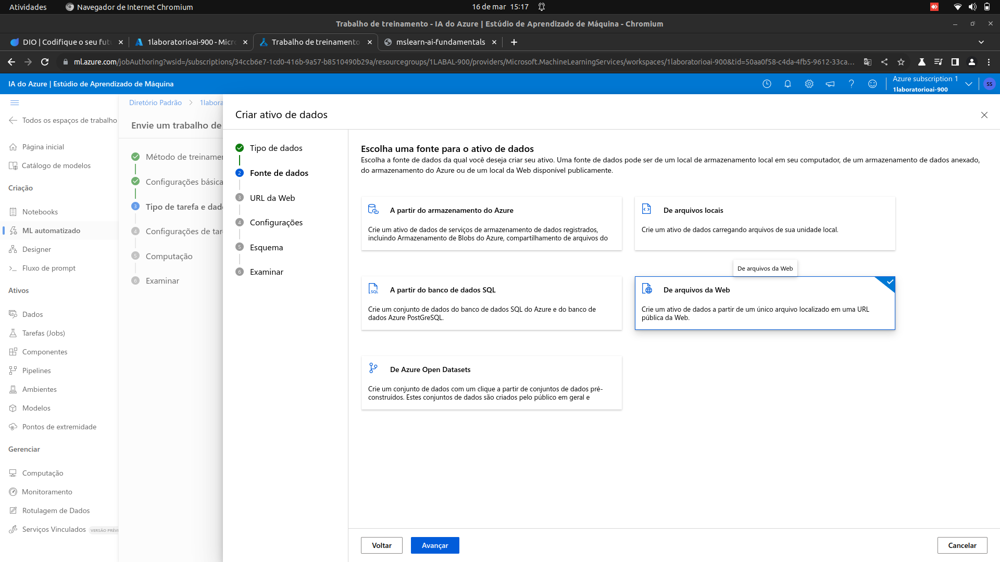

# Trabalhando-com-Machine-Learning-na-Pratica-no-Azure-ML

Objetivo : Criar um Modelo de Previsão no Azure Machine Learning 

Nesse projeto foi criado um Modelo de Regressão usando o Azure Machine Learning com as orientações da [Microsoft Learn](https://microsoftlearning.github.io/mslearn-ai-fundamentals/Instructions/Labs/01-machine-learning.html) e as aulas do BOOTCAMP da [DIO](https://web.dio.me/) em parceria com a Microsoft.

## Segue a sequência de etapas (Passo a passo) para obtenção do objetivo : 

## 1 . Logar no AZURE e criar um workspace do AZURE Machine Learning

Para isso, você precisa chegar nessa tela :

# Seguem as orientações do Microsoft Learn para criação do Workspace :

## 2. Depois de criado o worspace, a tela abaixo será apresentada e devera ser selecionado **Launch Estudio**
 

E será direcionado para esta tela e nela deverá ser selecionado  **ML Automatizado**:

## 3. Abaixo orientações da documentação com os passos para configurar o *Azure Machine Learning Studio* e orientações de como treinar o modelos:

### Seguem as telas com execução das orientações acima :

## 4. Avaliando o Melhor Modelo.

Vamos avaliar o melhor modelo treinado e os graficos de **residuos** e **predito_true** . Abaixo  a orientação da documentação e em seguida as telas da execução.

